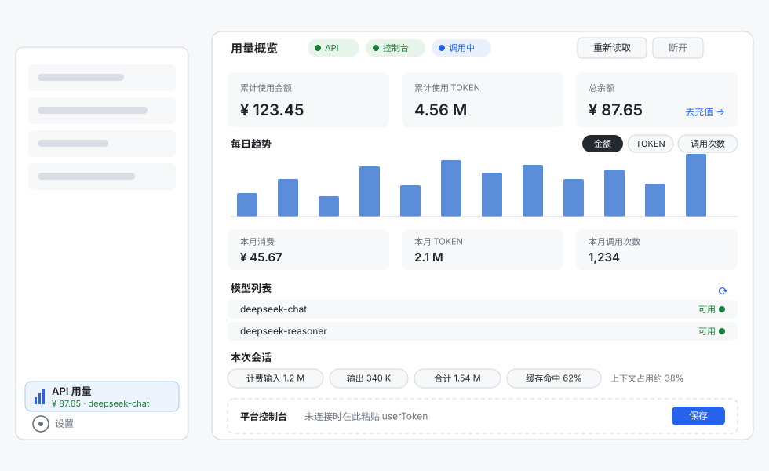

# dsh-plugin-usageledger

DeepSeek Harness（dsh）插件：侧边栏显示当前模型与账户余额，点开是一页用量账簿。
所有数字来自 DeepSeek 官方接口与 Harness 自身计量，插件自己不记账、不落盘。



## 数据来源

| 块         | 内容                                        | 来源与凭据                               |
| ---------- | ------------------------------------------- | ---------------------------------------- |
| 余额与模型 | 总余额 / 充值余额 / 赠金、模型列表          | 开放 API，需要 API Key                   |
| 控制台用量 | 累计金额 / 累计 TOKEN / 本月消费 / 每日趋势 | 平台控制台，需要控制台令牌（非 API Key） |
| 本次会话   | 计费输入 / 输出 / 合计 / 缓存命中           | Harness 计量投影，本机，无需凭据         |

三块口径不同，界面上分开显示、**互不相加**。「本次会话」的算法与官方消费方的 `billedInputTokens`
一致；无活跃会话或尚无用量记录时显示说明文字而不是 0。状态胶囊三态：绿 = 有数据（含部分失败后的
旧数据）、灰 = 未配置、红 = 报错并显示错误码（如 `NO_API_KEY`、`EXPIRED`、`TIMEOUT`）。

## 安装

要求 Node ≥ 20。

```powershell
dsh plugin --profile web add dsh-plugin-usageledger   # 或传本地目录路径（开发模式）
dsh web
```

安装后侧边栏底部出现「API 用量」一行，点开即用量概览。

## 凭据

| 凭据                      | 用途                           | 配置方式                         |
| ------------------------- | ------------------------------ | -------------------------------- |
| `DEEPSEEK_API_KEY`        | 余额、模型列表                 | dsh 凭据库，或进程环境变量       |
| `DEEPSEEK_PLATFORM_TOKEN` | 累计金额、累计 TOKEN、每日趋势 | 同上；也可以在用量概览里粘贴一次 |

只配 API Key 时余额立即可用；控制台令牌在已登录 `platform.deepseek.com` 的浏览器里从
`Application → Local Storage → userToken` 复制值，粘到概览窗底部的「平台控制台」卡片即可。
它是 64 字符不透明串（整段复制 Local Storage 的 JSON 信封也能通过），可长期用，失效时卡片会
提示重贴；`sk-` 开头的 API Key 会被拒绝防止混贴。令牌只存 dsh 凭据库，不写文件、不进日志、
不发给浏览器。凭据每次操作前重新解析，改完即生效，不用重启。

## 配置

写在 profile 的 `cordis.patch.yml` 或本包 `cordis.patch.yml` 的 `config` 段，全部可选，未知字段忽略：

| 字段                  | 默认                                              | 说明                         |
| --------------------- | ------------------------------------------------- | ---------------------------- |
| `apiKeyEnv`           | `DEEPSEEK_API_KEY`                                | API Key 凭据引用名           |
| `consoleTokenEnv`     | `DEEPSEEK_PLATFORM_TOKEN`                         | 控制台令牌凭据引用名         |
| `trackProviders`      | `['deepseek-official']`                           | 跟随哪些 provider 的在途模型 |
| `trackAllProviders`   | `false`                                           | 跟随全部 provider            |
| `api.enabled`         | `true`                                            | 是否读余额与模型列表         |
| `api.baseURL`         | `$DEEPSEEK_BASE_URL` → `https://api.deepseek.com` | 开放 API 根地址              |
| `api.intervalMs`      | `60000`                                           | 余额刷新周期                 |
| `api.timeoutMs`       | `8000`                                            | 单次请求超时                 |
| `platform.enabled`    | `true`                                            | 是否读控制台用量             |
| `platform.baseURL`    | `https://platform.deepseek.com`                   | 控制台根地址                 |
| `platform.intervalMs` | `300000`                                          | 用量刷新周期                 |
| `platform.timeoutMs`  | `10000`                                           | 单次请求超时                 |
| `sessionId`           | 未设                                              | 钉住「本次会话」报哪个会话   |
| `heartbeatMs`         | `15000`                                           | SSE 心跳间隔                 |
| `maxSseClients`       | `8`                                               | SSE 并发上限                 |
| `allowRemote`         | `false`                                           | 是否放行非 loopback 请求     |

数值字段有上下界，超界或解析不了就回落到默认值。

## 隐私与安全

- **零落盘**：快照只存宿主内存，按 TTL 缓存。
- **凭据不外泄**：令牌只留在宿主；HTTP 快照与 SSE 推送里只有 `configured / source / writable` 三个事实。
- **本机访问**：四个路由默认只接受 loopback 来源；宿主提供 `connection` 服务时沿用其鉴权结论。
- **无第三方依赖**：宿主半侧只用 Node 内置模块，浏览器半侧只依赖宿主已提供的 `react`。

## 已知限制

- 控制台接口非官方文档化 API：单项读不到显示 `—`，形状全变时退回「未连接」。
- 控制台数字是账户级的，分不出哪些由 dsh 发起，与「本次会话」不可相加。
- 「本次会话」依赖 `dsh-token-meter`：没挂载时显示「尚无用量记录」而不是报错。
- 币种不换算：账户同时有人民币和美元时固定显示人民币；趋势只画当月。
- 部分失败仍出数：summary 与 series 独立读取，一个失败时另一半照常显示。

## 开发

```powershell
node --test test/*.test.mjs    # 90 项
node scripts/diagnose-platform.mjs   # 打印控制台接口原始形状（只读，不写盘）
```

测试按模块拆在 `test/*.test.mjs`，测试替身在 `test-utils/harness.mjs`（不参与测试发现）。

## 许可

MIT，见 [LICENSE](LICENSE)。
