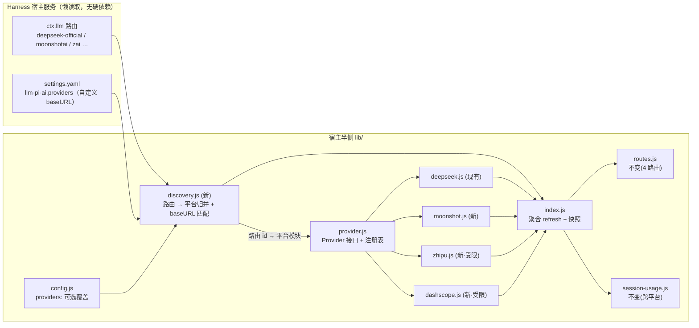
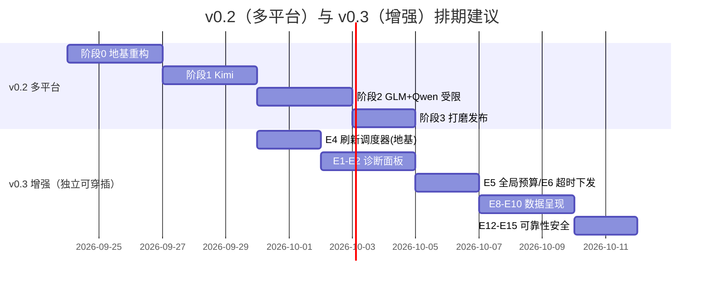

# dsh-plugin-usageledger 升级计划 v0.2

> 状态：草案（2026-09-23，范围已按平台收敛；账单卡改为「发现驱动动态生成」）
> 前置：v0.1.0（DeepSeek 单平台）。本文覆盖「多平台用量查询」升级的方向分析、可行性结论、架构改造与需求清单；§8 是多平台之外的增强与设计优化方向池（v0.3）。

---

## 1. 背景：TIMEOUT 问题的启示（v0.1.x 已修复）

明细界面显示 `TIMEOUT · request timed out after 8000ms` 的根因有两层，均已在当前版本修复：

| #   | 根因                                                                                                                                                                                                                                                                                                              | 修复                                                                                                                                 |
| --- | ----------------------------------------------------------------------------------------------------------------------------------------------------------------------------------------------------------------------------------------------------------------------------------------------------------------- | ------------------------------------------------------------------------------------------------------------------------------------ |
| 1   | **默认超时过紧**。`api.timeoutMs` 默认 8000ms；DeepSeek 开放 API（`/user/balance`、`/models`）与控制台接口在国内网络高峰期 P95 延迟常超 8s，控制台还有一次 5 个请求的突发（summary + amount + cost 并发），固定 8s 必然周期性触发 TIMEOUT                                                                         | 默认值提高：`api.timeoutMs` 8000→15000，`platform.timeoutMs` 10000→20000                                                             |
| 2   | **中止形态识别过窄**。中止判定只认 `error.name === 'AbortError'`；Node 20+ 与浏览器的 `AbortSignal.timeout()` 可能抛 `DOMException`（`name === 'TimeoutError'`），或把 `signal.reason`（message 含 "aborted" 的普通 Error）作为拒绝原因。这些形态被误判为 `NETWORK`，面板显示原始 socket 错误串而非可翻译的超时码 | 新增 `isAbortFailure()`，同时匹配 `AbortError` / `TimeoutError` / message 中的 abort 语义                                            |
| 3   | **错误文案不可操作**。面板直接显示 `TIMEOUT · request timed out after 8000ms`，只诊断不给 remedy                                                                                                                                                                                                                  | UI 新增 `errorText()` 助手：TIMEOUT 显示为「网络超时，可稍后重试，或在 profile 配置里调大 timeoutMs」，未知码仍透传 `CODE · message` |

**对升级计划的启示**：多平台后，出错面从 2 个凭据 × 5 个端点扩大到 N 个平台 × 各自端点。错误必须「带 remedy」「按平台隔离」「部分失败不拖垮整体」——这从第一天就要进架构，而不是事后补。

---

## 2. 多平台支持可行性分析

### 2.1 候选平台 API 盘点

调研结论（2026-09，均为公开文档核实的**官方**接口；「开放 API」= 用 API Key 即可，无需网页登录态）：

| 平台                                                 | 账户余额                                                                                                                     | 模型列表                                               | 用量明细 / 统计                                                                         | 鉴权                                                                                                     | 可行性                                                                                                                                                                                                         |
| ---------------------------------------------------- | ---------------------------------------------------------------------------------------------------------------------------- | ------------------------------------------------------ | --------------------------------------------------------------------------------------- | -------------------------------------------------------------------------------------------------------- | -------------------------------------------------------------------------------------------------------------------------------------------------------------------------------------------------------------- | ------- |
| **DeepSeek**（现状）                                 | `GET /user/balance` ✅ 官方文档                                                                                              | `GET /models` ✅                                       | 开放 API **无**用量端点，靠控制台 `api/v0/users/get_user_summary`、`api/v0/usage/amount | cost`（JWT，逆向但已稳定运行）                                                                           | Bearer                                                                                                                                                                                                         | ✅ 基线 |
| **Moonshot Kimi**（platform.moonshot.cn / kimi.com） | `GET /v1/users/me/balance` ✅ 官方「查询账户余额」端点（返回 `available_balance`、`voucher_balance` 等，单位元）             | `GET /v1/models` ✅ OpenAI 兼容                        | 开放 API **无**历史用量端点；控制台数据无公开 API                                       | Bearer（普通 API Key 即可）                                                                              | ✅ **余额层最容易接入的平台**（OpenAI 兼容 + 官方余额端点，无控制台令牌门槛）                                                                                                                                  |
| **智谱 GLM**（open.bigmodel.cn）                     | 开放 API **无**公开余额端点；`/pgc/balance/...` 类端点未被官方文档稳定承诺                                                   | `GET /v1/models`（部分场景）                           | 无公开用量 API；控制台内部接口鉴权方式（cookie + 签名）未文档化且不稳定                 | Bearer（API Key）                                                                                        | ⚠️ **仅能靠会话内计量 + 模型列表**；余额/账单需后续跟踪官方发布                                                                                                                                                |
| **阿里云百炼 Qwen**（DashScope）                     | 开放 API **无**余额端点；账单需阿里云 BSS OpenAPI（RAM 签名），复杂度远超插件范围，不可行                                    | `GET /compatible-mode/v1/models` ✅（OpenAI 兼容模式） | 无公开用量 API；`stream_options.include_usage` 仅反映单次请求，无账户级历史             | Bearer（DASHSCOPE_API_KEY，**按地域绑定**：北京/弗吉尼亚/新加坡/东京；跨地域调用 401 `invalid_api_key`） | ⚠️ **与 GLM 同级：受限支持**（模型列表 + 会话计量）；必须支持自定义 baseURL 匹配地域专属域名（`{WorkspaceId}.cn-beijing.maas.aliyuncs.com/compatible-mode/v1` 或 `dashscope.aliyuncs.com/compatible-mode/v1`） |
| **SiliconFlow**                                      | `GET /v1/user/info` ✅（返回 `balance`、`chargeBalance`、`totalBalance`，单位元）                                            | `GET /v1/models` ✅                                    | `GET /v1/usage/daily_series`（部分套餐可用，需确认配额）                                | Bearer                                                                                                   | ✅ 余额 + 模型层可接入                                                                                                                                                                                         |
| **OpenRouter**                                       | `GET /api/v1/credits` ✅ 官方（返回 `total_credits`、`total_usage`；注意需要 **Management Key** 而非推理 Key）               | `GET /api/v1/models` ✅                                | `GET /api/v1/activity`（按天/按模型用量，官方文档化）                                   | Bearer（Management Key）                                                                                 | ✅ **用量数据最完善的平台**，但密钥分级是用户混淆点                                                                                                                                                            |
| **OpenAI / Anthropic**                               | OpenAI：`GET /v1/organization/costs`（管理端点，需 admin key）；Anthropic：`GET /v1/organizations/usage_report`（admin key） | —                                                      | 官方文档化，但需要组织级管理密钥                                                        | Bearer（Admin Key）                                                                                      | ⚠️ 可行但密钥门槛高，放低优先级                                                                                                                                                                                |

**结论（范围已收敛）**：

- **范围内 · 完整支持**：**Kimi** —— 唯一有官方余额端点（`GET /v1/users/me/balance`）的新平台，OpenAI 兼容、单凭据，接入成本与 DeepSeek 余额层几乎相同。
- **范围内 · 受限支持**：**GLM、Qwen（DashScope）** —— 均无公开余额/用量端点（Qwen 账单走阿里云 BSS OpenAPI，RAM 签名复杂度远超插件范围），只能靠 Harness 会话计量 + 模型列表；Qwen 额外受「API Key 按地域绑定」约束，必须允许自定义 baseURL。UI 明示「该平台余额接口未开放」，跟踪官方进展后补齐。
- **范围外（backlog）**：SiliconFlow（技术可行：`/v1/user/info`）、OpenRouter（用量数据最完善但需 Management Key）、OpenAI/Anthropic（Admin Key）—— 为控制首版范围与密钥分级教育成本移入 backlog。

### 2.2 关键架构判断

1. **“控制台逆向”路径不推广**。DeepSeek 控制台 token 方案（Local Storage JWT + 浏览器 UA）是特定历史产物，脆弱且维护成本高。其他平台一律走官方开放 API；没有官方用量端点的平台（GLM）就诚实地只显示会话级数据。
2. **「本次会话」天然跨平台**。Harness 的 `tokenMeter` 投影记录的是 provider 上报的真实用量，与平台无关——这是多平台版唯一无需任何凭据就能立刻工作的块，应保留现有架构不动。
3. **每平台一个 client 模块 + 统一 `Provider` 接口**。现有 `deepseek.js` 的 `fetchBalance/fetchModels` 已是天然的原型：抽出 `provider.js` 定义契约，`deepseek.js`/`moonshot.js`/`zhipu.js`/`dashscope.js` 各自实现，宿主聚合（backlog 平台按同一契约随时可加）。
4. **快照结构演进而非重写**。`snapshot.api` / `snapshot.console` 变为 `snapshot.providers[<id>]`，客户端把「每个平台一张卡」。旧字段保留一个版本作 alias，避免破坏已发布的客户端。
5. **账单卡由接入事实驱动，不由配置写死**（v0.2 核心升级）。平台清单不来自插件自己的 `providers` 配置数组，而是从 Harness 的模型路由发现：内置提供方（`deepseek-official`、`moonshotai`（Kimi）、`zai`（GLM）等）从 `ctx.llm` 路由读取，自定义提供方从 `settings.yaml` 的 `llm-pi-ai.providers` 读取（每条都带 baseURL / apiKeyEnv / models）。发现到几条路由，就渲染几张账单卡；用户在模型页加一个 Kimi key，明细窗自动出现 Kimi 卡片，无需改任何插件配置。插件配置里的 `providers` 数组降级为**可选覆盖**（重命名/禁用/改 baseURL），默认完全不写。

---

## 3. 目标架构（v0.2）



**Provider 接口契约**（每个平台模块必须实现，纯函数 + 注入 fetch，与现有 deepseek.js 一致）：

```ts
interface UsageProvider {
	id: string; // 'deepseek-official' | 'moonshot' | 'zhipu' | 'dashscope'
	label: string; // 界面显示名
	docsURL: string; // 凭据指引链接
	credentialRef(config): string; // 该平台凭据引用名（可被路由的 apiKeyEnv 覆盖）
	capabilities: { balance: boolean; models: boolean; usage: boolean };
	/** baseURL → 平台归一：自定义网关按域名匹配归属；未知域名返回 null（仅会话计量）。 */
	matchBaseURL?(baseURL: string): boolean;
	fetchBalance?(ctx: ProviderCall): Promise<Balance>;
	fetchModels?(ctx: ProviderCall): Promise<ModelInfo[]>;
	fetchUsage?(ctx: ProviderCall, month: string): Promise<Usage>;
}
```

**发现与归并规则**（`discovery.js`，账单卡生成的数据源）：

1. 读 `ctx.llm` 已注册路由 + `settings.yaml` 的 `llm-pi-ai.providers`（每条含 `apiKeyEnv`/`baseURL`/`api`/`models`），去重成「路由 → baseURL → 凭据引用」三元组清单。
2. 每条路由按 provider id（`moonshotai`→moonshot、`zai`→zhipu、`deepseek-official`→deepseek）归属平台模块；自定义路由按 `matchBaseURL` 域名匹配（如 `*.moonshot.cn`、`open.bigmodel.cn`、`*.aliyuncs.com`），未匹配的路由归入通用 OpenAI 兼容组——只有会话计量，无余额/用量 API。
3. `snapshot.providers` 只含**发现到**的平台；凭据已配但模型页从未接入的平台不占卡。会话计量按 provider 分组兜底：只要有调用记录，即使凭据未配，也出一张「仅会话用量」卡。

不变量（升级中必须保持的项目承诺）：

- 零落盘、零第三方依赖（宿主半侧仅 node: 内置）；
- 凭据只在宿主，快照永不携带；
- 每次操作前重新解析凭据；
- 各平台数据**互不相加**——多平台后这一条从「三块口径分开」升级为「每平台一卡，总和行不显示」。

---

## 4. 分阶段升级计划

### 阶段 0：地基重构（不改 UI）· 约 3~4 天

- [ ] R0.1 从 `deepseek.js` 抽出 `provider.js` 契约与注册表；`deepseek.js` 改为第一个实现。
- [ ] R0.2 **`discovery.js` 路由发现**：懒读取 `ctx.llm` 路由与 `settings.yaml`（`llm-pi-ai.providers`），归并为平台清单；`config.js` 的 `providers` 数组降级为可选覆盖（重命名/禁用/凭据引用覆盖），旧字段向后兼容映射进 `deepseek-official`。
- [ ] R0.3 `index.js` 的 `refreshApi/refreshUsage` 泛化为按发现到的平台并发刷新（`Promise.allSettled`，单平台失败不阻塞其余）。
- [ ] R0.4 快照增加 `providers` map（只含发现到的平台 + 有会话记录的平台）；旧 `api`/`console` 字段保留一个版本作兼容 alias。
- [ ] R0.5 全量测试改造：`plugin.test.mjs` 的快照断言走新结构；新增「加一条 moonshot 路由即多一张卡」「自定义网关路由归入会话计量组」「无凭据但有调用记录仍出卡」回归。

### 阶段 1：Kimi 接入 + 动态账单卡 · 约 3~4 天

- [ ] R1.1 `moonshot.js`：`GET /v1/users/me/balance` + `GET /v1/models`（`moonshotai` 路由自动归入；baseURL 默认 `https://api.moonshot.cn/v1`，凭据引用取路由的 `apiKeyEnv`，默认 `MOONSHOT_API_KEY`）。
- [ ] R1.2 错误码统一映射：401/402/429 → 既有 `UNAUTHORIZED/INSUFFICIENT_BALANCE/RATE_LIMITED`，超时走统一 `isAbortFailure`。
- [ ] R1.3 **动态账单卡 UI**：明细窗按 `snapshot.providers` 渲染——每平台一卡（余额/模型/用量三区，缺能力显式标注），卡片顺序按最近使用排序；标题栏每平台一枚 pill；新增「+ 添加平台」引导指向 Harness 模型页（不在插件里重复做凭据表单）。
- [ ] R1.4 文案与文档：DICT 增补平台徽标与能力缺失说明；README 配置表改为「发现驱动 + 可选覆盖」。

### 阶段 2：GLM + Qwen 受限支持 · 约 2~3 天

- [ ] R2.1 `zhipu.js`：仅 `fetchModels` + 会话计量；`capabilities.balance=false`（baseURL `https://open.bigmodel.cn/api/paas/v4`）。
- [ ] R2.2 `dashscope.js`：仅 `fetchModels`（OpenAI 兼容 `GET /compatible-mode/v1/models`）+ 会话计量；`capabilities.balance=false`；**baseURL 必须可配**（地域专属域名或原域名 `dashscope.aliyuncs.com/compatible-mode/v1`），`invalid_api_key` 映射为带 remedy 的 `KEY_REGION_MISMATCH`（提示 Key 与 endpoint 地域不匹配，而非笼统 401）。
- [ ] R2.3 UI 对不可用能力显示「该平台暂未开放余额接口」而非报错；持续跟踪两家官方 API 发布后补齐。
- [ ] R2.4 诊断脚本：`diagnose.mjs zhipu|dashscope` 探索性验证 `/pgc/balance` 类端点（只读，不进生产路径）。

### 阶段 3：打磨与发布 · 约 2 天

- [ ] R3.1 多平台轮询预算：单平台独立 TTL/退避；总请求数封顶（防止 N 平台 × 5 端点的刷新风暴）。
- [ ] R3.2 超时策略复检：每平台 `timeoutMs` 默认 15s（开放 API）/ 20s（慢端点），沿用 v0.1.x 的教训。
- [ ] R3.3 诊断脚本泛化：`diagnose-platform.mjs` → `diagnose.mjs <provider>`。
- [ ] R3.4 类型定义 `lib/types/*` 与 packaging 测试同步；v0.2.0 发布 + CHANGELOG。

---

## 5. 现有功能设计不足清单（升级要一并解决的）

以下问题在单平台版已存在，多平台化会放大它们，属于升级范围内必改：

| #   | 不足                                                                                                                             | 现状证据                                         | 升级方向                                                                           |
| --- | -------------------------------------------------------------------------------------------------------------------------------- | ------------------------------------------------ | ---------------------------------------------------------------------------------- |
| G1  | **控制台 token 是唯一脆弱环节**：非官方 API，形状变化即退化为「未连接」，且用户要手抄 JWT                                        | `platform.js` 整个容错层、`ConsoleCard` 粘贴引导 | 多平台只走官方 API；DeepSeek 控制台能力标记为 `experimental`，失败不再作为整体错误 |
| G2  | **轮询与刷新缺乏全局预算**：`fastIntervalMs=2000` + `warmup [1500,4000,8000]` + 强制刷新 2s 下限；N 平台后每 tick 请求数线性膨胀 | `index.js` lifecycle 段                          | 引入全局并发/频率预算；warmup 收敛为一次；指数退避已有，需按平台隔离               |
| G3  | **错误展示不可操作**：曾直接把 `TIMEOUT · request timed out after 8000ms` 丢给用户                                               | v0.1.x 明细界面                                  | `errorText()` 已做第一层；升级为「错误码 → remedy → 文档链接」结构化映射           |
| G4  | **客户端超时不可配**：浏览器半侧 `REQUEST_TIMEOUT_MS = 10000` 写死，慢网下 refresh 按钮会「假失败」                              | `client.js` L417                                 | 提升到 20s 并对齐宿主 timeoutMs；后续可由快照下发                                  |
| G5  | **多币种静态化**：固定人民币视图，趋势只画当月                                                                                   | README 已知限制                                  | 多平台后 USD 账户（OpenRouter）必然出现：每卡带币种徽标，仍不换算                  |
| G6  | **「本次会话」无跨会话历史**：仅当前会话，重启即空                                                                               | `session-usage.js` 设计如此（零落盘约束）        | 保持零落盘，可选「跟随 provider 过滤」（配置 `trackProviders` 已经有雏形）         |
| G7  | **SSE 单点**：`maxSseClients=8` 上限 + 客户端 3 次重试后永久降级为轮询                                                           | `routes.js` / `client.js`                        | 保留；多平台快照变大后给 SSE 帧加体积上限与 diff 推送评估项                        |
| G8  | **凭据混用防护只有一种**：仅 DeepSeek 有 `sk-` 前缀检测                                                                          | `config.js looksLikeConsoleToken`                | 通用化：每平台声明自己的凭据形状校验，防错贴                                       |

---

## 6. 初始需求清单（v0.2 多平台用量账簿）

### P0 — 必须有

| ID     | 需求                                                                                                      | 验收要点                                                                                                                                                       |
| ------ | --------------------------------------------------------------------------------------------------------- | -------------------------------------------------------------------------------------------------------------------------------------------------------------- |
| REQ-1  | 平台发现驱动（默认）+ `providers` 可选覆盖：每平台可覆盖 `enabled/baseURL/timeoutMs/intervalMs/apiKeyEnv` | 账单卡自动跟随 Harness 模型页的路由增删；未知字段忽略；旧配置完全兼容（单平台用户升级零改动）                                                                  |
| REQ-2  | Kimi 余额 + 模型列表                                                                                      | API Key 即可；401 → UNAUTHORIZED；余额单位与官方一致（元）                                                                                                     |
| REQ-3  | SiliconFlow 余额 + 模型列表                                                                               | **backlog**：技术可行，首版不做                                                                                                                                |
| REQ-4  | 每平台独立错误隔离                                                                                        | 任一平台失败：其余平台照常出数；失败平台的卡片显示错误码 + remedy                                                                                              |
| REQ-5  | UI 动态账单卡                                                                                             | 明细窗按发现到的平台渲染，无固定卡模板：平台数 = 卡数；每卡三区（余额/模型/用量）按 `capabilities` 显隐；仅会话计量的通用网关也占卡；标题栏每平台一枚 pill     |
| REQ-6  | 凭据安全不变量保持                                                                                        | 快照/SSE/日志零凭据；每平台凭据形状校验防错贴；`packaging.test` 断言继续通过                                                                                   |
| REQ-7  | 超时与中止判定统一                                                                                        | 所有平台 client 复用 `isAbortFailure`；TIMEOUT 文案带 remedy                                                                                                   |
| REQ-8  | GLM + Qwen 受限支持（模型列表 + 会话计量）                                                                | Qwen 需支持地域化 baseURL 与 `KEY_REGION_MISMATCH` 映射；`capabilities.balance=false` 优雅降级                                                                 |
| REQ-18 | 路由 → 平台自动归并（discovery.js）                                                                       | `ctx.llm` + `settings.yaml llm-pi-ai.providers` 归并去重；内置 id 直映射（`moonshotai`/`zai`），自定义路由按 `matchBaseURL` 域名匹配，未知域名归入仅会话计量组 |

### P1 — 应该有

| ID     | 需求                             | 说明                                                          |
| ------ | -------------------------------- | ------------------------------------------------------------- |
| REQ-9  | 全局刷新预算                     | 请求/分钟封顶；warmup 收敛；退避按平台隔离                    |
| REQ-10 | 「本次会话」按 provider 过滤展示 | 数据结构已含 provider，纯 UI 分组                             |
| REQ-11 | 诊断脚本泛化                     | `node scripts/diagnose.mjs <provider>` 打印该平台原始响应形状 |

### P2 — 可以有

| ID     | 需求                                     | 说明                                                                                                                |
| ------ | ---------------------------------------- | ------------------------------------------------------------------------------------------------------------------- |
| REQ-13 | 多币种徽标 + 按平台币种显示              | 不做汇率换算，只正确标注                                                                                            |
| REQ-14 | SSE diff 推送                            | 快照超过阈值时只推变化字段                                                                                          |
| REQ-15 | OpenRouter credits + activity（backlog） | 需 Management Key；403 时提示密钥分级                                                                               |
| REQ-16 | 每平台 usage 的成本估算（本地价格表）    | 明确标注「估算」，与平台账单口径分开                                                                                |
| REQ-17 | dsh 口径累计用量块（附录 A.3 第 3 条）   | 注册跨会话投影折叠本 Harness 发起的累计 tokens；与控制台账户口径分卡显示、永不相加；纯 dsh 用户不配令牌也能看到累计 |

### 非功能需求（贯穿）

- **NFR-1 隐私**：凭据不落盘、不进日志、不发给浏览器（多平台下逐平台断言）。
- **NFR-2 零依赖**：宿主半侧仅 `node:` 内置模块；浏览器半侧仅宿主 `react`。
- **NFR-3 口径纪律**：任何两个平台的数字、平台与会话的数字，永不在同一行相加。
- **NFR-4 可测性**：每平台 client 都通过 `fetchImpl` 注入测试；总测试数与覆盖不减。

---

## 7. 风险与开放问题

| 风险                                                             | 缓解                                                                   |
| ---------------------------------------------------------------- | ---------------------------------------------------------------------- |
| 各平台错误语义不一（如 OpenRouter 403 = 密钥分级，GLM 可能 404） | Provider 接口内完成「平台错误 → 统一码」映射，UI 只认统一码            |
| OpenRouter Management Key 与推理 Key 混贴是高频用户错误          | 形状校验 + 403 场景专用文案                                            |
| 部分平台余额端点响应无稳定 schema 承诺                           | 沿用 DeepSeek 控制台的容错读取模式：读不出显示 `—`，形状签名进诊断日志 |
| 配置数组化后旧 profile 兼容                                      | 映射层 + packaging 测试锁定旧行为                                      |
| 快照体积随平台数增长                                             | SSE 帧上限 + diff 推送评估（REQ-14）                                   |

**开放问题**：

1. DeepSeek 控制台 token 能力是否继续新用户引导？→ **已确认（附录 A）**：不可被现有能力覆盖，保留但标记 experimental，UI 折叠
2. `providers` 配置是否支持「未配置凭据的平台自动隐藏卡片」？（建议：是，但保留「已启用未配置」的添加引导）
3. 汇率换算永久不做是否可接受？（建议：做徽标 + 官方充值链接跳转，不做换算）

---

## 8. 多平台之外的增强与设计优化（v0.3 方向池）

> 以下不依赖多平台改造，可独立排期；按「用户价值 × 实现成本」排序。每项标注它修复的现有设计缺陷（对照 §5 的 G 编号）。

### 8.1 观测与自诊断（修复 G3 的深水区）

| #   | 增强                    | 说明                                                                                                                                        | 为什么值得                                                           |
| --- | ----------------------- | ------------------------------------------------------------------------------------------------------------------------------------------- | -------------------------------------------------------------------- |
| E1  | **自诊断面板**          | 明细窗加「诊断」折叠区：每个数据源最近一次请求的 `状态码 / 耗时 / 时间 / 错误码`（不含任何值与凭据），提供「复制诊断信息」按钮输出脱敏 JSON | 用户报障时无需翻宿主日志；TIMEOUT/EXPIRED 这类问题从「猜」变成「看」 |
| E2  | **请求级指标沉淀**      | 宿主在内存里保留每个端点最近 N 次的 `耗时 / 结果` 环形缓冲（零落盘约束不变），快照只暴露聚合值（P95、失败率）                               | 是 E1 的数据底座；也回答「8000ms 超时是偶发还是常态」这类问题        |
| E3  | **诊断脚本泛化 + 探针** | `diagnose.mjs <provider>` 已在计划内；再补 `--probe` 模式：不带凭据探测端点连通性（HTTP 状态 + 延迟），用于区分「网络不通」与「凭据失效」   | 部署排障的第一步分流；对内网代理环境尤其有用                         |

### 8.2 刷新与网络策略（修复 G2/G4）

| #   | 增强                 | 说明                                                                                                                                        | 为什么值得                                                                |
| --- | -------------------- | ------------------------------------------------------------------------------------------------------------------------------------------- | ------------------------------------------------------------------------- |
| E4  | **统一的刷新调度器** | 把 `refreshApi/refreshUsage/refreshSessionUsage` 的 TTL、minRefresh、inflight 去重、退避收敛成一个 `createScheduler()`；多平台只是 N 个槽位 | 现在三套相似逻辑分散在 index.js 各处（G2 的根因），收敛后才可能加全局预算 |
| E5  | **全局请求预算**     | 每 tick 与每分钟的总出站请求数封顶；超预算的平台顺延到下一 tick，快照标注 `throttled`                                                       | 防 N 平台刷新风暴（升级计划 REQ-9 的具体实现位）                          |
| E6  | **客户端超时下发**   | 快照携带宿主各源 `timeoutMs`，浏览器 `REQUEST_TIMEOUT_MS` 取 `max(自身下限, 宿主值)`；refresh 按钮的等待时间与宿主真实超时对齐              | 修复 G4：浏览器 10s 写死导致「宿主还没放弃、按钮先报失败」的假失败        |
| E7  | **指数退避带抖动**   | 宿主已有退避（`fastAttempt`），补 jitter 防止多实例同时恢复造成的同步脉冲                                                                   | 小改动；多平台后抖动价值放大                                              |

### 8.3 数据呈现（修复 G5，扩大既有数据的用途）

| #   | 增强                       | 说明                                                                                                                | 为什么值得                                                                    |
| --- | -------------------------- | ------------------------------------------------------------------------------------------------------------------- | ----------------------------------------------------------------------------- |
| E8  | **跨月趋势窗口**           | 趋势图支持 `本月 / 近 30 天 / 近 3 个月` 切换：宿主对平台端点按月循环拉取（并发受 E5 预算约束），客户端只改渲染窗口 | 现有 `usage.days` 数据结构不变；DeepSeek 趋势只画当月是 README 明示的已知限制 |
| E9  | **按模型用量表**           | `usage.models` 已归一化但 UI 只显示模型列表 chips；加一张「本月按模型」排序表（token/费用/占比条）                  | 数据已在快照里，纯前端工作；对多模型用户是刚需                                |
| E10 | **会话明细内联**           | 「本次会话」块加可展开的历史请求计数（`calls`、平均输出长度等 meter 已有但未展示的字段）                            | 无新数据依赖；让会话块从三个大数变成可解释的明细                              |
| E11 | **多币种徽标**（= REQ-13） | 每张卡右上角币种徽标；多平台后 USD 账户必然出现，提前做                                                             | 修复 G5 的最小版本，不涉及换算                                                |

### 8.4 可靠性与安全（修复 G1/G7/G8）

| #   | 增强                                            | 说明                                                                                                                  | 为什么值得                                                                    |
| --- | ----------------------------------------------- | --------------------------------------------------------------------------------------------------------------------- | ----------------------------------------------------------------------------- |
| E12 | **DeepSeek 控制台降级为 experimental**          | 不删除，但：默认折叠、`platform.enabled` 文档标注 experimental、形状变化时自动退避并标记 `degraded` 而非报错          | G1 的正面解法：逆向端点是唯一会「悄悄全挂」的源，降级后失败不再污染整体状态灯 |
| E13 | **SSE 降级策略改进**（= G7）                    | 客户端 3 次重试预算改为「1 分钟内最多 3 次」的滑动窗口；恢复后自动重试 SSE                                            | 现在一旦降级为轮询就永不回 SSE，页面开一整天就一直轮询                        |
| E14 | **凭据形状校验泛化**（= G8）                    | 每平台声明 `validateCredential(value)`：DeepSeek `sk-` 前缀、Kimi OpenAI 风格 key、Qwen/Gemini 风格等；粘贴时即时校验 | 防多平台凭据互相错贴——多平台后这是最高频用户错误                              |
| E15 | **凭据轮换提醒**                                | `credentials.describe` 若返回过期时间则快照携带 `expiresHint`；UI 在临近过期时黄牌提示「即将失效」                    | EXPIRED 目前是事后才知道；提前一天提示可避免半夜断供                          |
| E16 | **官方 usage 端点上线探针**（附录 A.3 第 4 条） | `diagnose.mjs deepseek --probe` 增加 `/v1/usage` 类端点探测；同时开放 API 的 404 响应体若从 `Not Found` 变化则警告    | 用于及早发现官方用量端点发布，触发逆向路径退役                                |

### 8.5 明确不做的（负空间）

- **本地持久化 / 历史落盘**：违背「零落盘」核心承诺，不做。跨月趋势靠平台端点按月拉，不靠本地缓存历史。
- **汇率换算**：永远显示平台报价币种，换算引入的第二口径弊大于利。
- **自动充值 / 账户操作**：插件只读，所有「去充值」都是外链。
- **第三方用量代理**（如通过 OpenRouter 查所有平台）：引入中间人信任问题，且数字口径经二手转换，不做。

### 8.6 建议排期



> 排期关键点：**E4（刷新调度器）应插在 v0.2 阶段 1 之后**——它本身就是阶段 3「多平台轮询预算」的实现底座，先做 E4 可以避免阶段 3 返工。E1–E3 诊断能力建议在多平台发布前完成：新平台接入期正是报障高峰。

---

## 附录 A：控制台 token 能力的可替代性确认（2026-09-23 核实）

**问题**：DeepSeek 控制台 token 能力能否被新能力覆盖？覆盖目标是：① 用户余额；② 累计使用量/费用；③ 使用量趋势。

### A.1 逐项结论

| 目标                        | 控制台 token 现状                                                     | 可替代来源                                                              | 结论                                                        |
| --------------------------- | --------------------------------------------------------------------- | ----------------------------------------------------------------------- | ----------------------------------------------------------- | --------------------------------- |
| ① 用户余额                  | `get_user_summary` 顺带可读                                           | **官方开放 API `GET /user/balance`**（`sk-` key，文档化端点，插件已接） | ✅ **已完全覆盖**。控制台的余额读取可退役，余额不再依赖令牌 |
| ② 累计使用量/费用           | `get_user_summary`（`total_costs` / `monthly_costs`）+ `/usage/amount | cost`                                                                   | 见 A.2 逐一排查                                             | ❌ **不可替代**。无任何官方替代源 |
| ③ 使用量趋势（每日/按模型） | `/usage/amount` + `/usage/cost`                                       | 同上                                                                    | ❌ **不可替代**。无任何官方替代源                           |

### A.2 累计用量/费用的候选来源逐一排查

| 候选                                                        | 核实结果                                                                                                                                                                       | 判定                                        |
| ----------------------------------------------------------- | ------------------------------------------------------------------------------------------------------------------------------------------------------------------------------ | ------------------------------------------- |
| DeepSeek 开放 API                                           | 官方文档端点全清单：chat/completions、FIM、models、**balance**、files、上传/列出文件——**无任何 usage/billing 类端点**（2026-09 核实）                                          | ❌ 无                                       |
| Harness 会话计量（`ctx.sessionProjections` / `tokenMeter`） | 只计量**经本 Harness 发起**的调用，且投影按会话折叠；官方架构文档确认 `stateOf()` 读的是单会话类型化状态。API Key 同时被其他工具（curl、SDK、其他产品）使用时无法计入          | ❌ 口径不同，覆盖不了账户级                 |
| Harness 持久会话日志跨会话折叠                              | 会话日志是追加式持久事实（JSONL），理论上可注册一个跨会话投影折叠出「dsh 发起的累计用量」——但仍是 harness 口径，不是账户口径，且「累计费用」需要价格表参与计算（引入估算口径） | ⚠️ 只能作为**部分补充**（见 A.3），不能覆盖 |
| 阿里云等第三方托管 DeepSeek 的账单接口                      | 那是百炼的账单，不是 DeepSeek 账户的；且 BSS OpenAPI 需要 RAM 签名，超出插件范围                                                                                               | ❌ 不适用                                   |

### A.3 决议

1. **保留控制台 token 能力**，标记 `experimental`（与 E12 一致）：它是「累计使用量/费用 + 趋势」的唯一官方数据源，不可移除。
2. **余额与控制台解耦**：余额卡片只走开放 API（现状已如此）；控制台 token 仅用于用量两块，令牌失效不影响余额显示。
3. **新增可选的部分补充**（P2，REQ-17）：注册跨会话投影，展示「dsh 发起的累计用量（本机口径）」作为第三块，与控制台的账户口径**分卡显示、永不相加**——纯 dsh 用户的累计数字不再依赖令牌，但 UI 必须明确标注口径差异。
4. **长期跟踪**：一旦 DeepSeek 开放 API 发布官方 usage 端点（参照 Kimi 余额端点的模式），立即替换控制台逆向路径并退役令牌流程。诊断脚本 `diagnose.mjs deepseek --probe` 增加 usage 端点探测，用于及早发现官方端点上线。

> **一句话结论**：余额已被开放 API 覆盖；累计使用量/费用与趋势在官方 API 补齐用量端点之前**只能**依赖控制台 token，不可退役，只能降级为 experimental 并做口径隔离。
